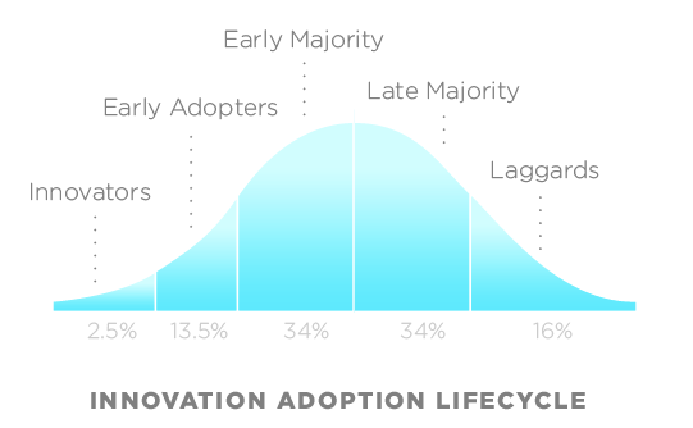

# TASC Technical Specification Development

**Source**: TASC  
**Recommendation**: GA4GH-REC-04  
**Title**: TASC Technical Specification Development: Policy and processes for developing and communicating maturity of GA4GH Technical Specifications  
**Related GitHub issues**: [#64](https://github.com/ga4gh/TASC/issues/64), [#49](https://github.com/ga4gh/TASC/issues/49), [#16](https://github.com/ga4gh/TASC/issues/16), [#46](https://github.com/ga4gh/TASC/issues/46)  
**Raised by**: Alex Wagner (GKS)  
**Authors**: Alex Wagner, Larry Babb, Robert Freimuth, GKS Work Stream  
**Date:** 2025-07-18  
**Status:** Approved  
**Keywords**: maturity-model, versioning, specification, lifecycle  
**Work Streams Impacted**: All work streams  
**Products Affected**: All GA4GH specifications  

## Abstract

This policy defines the maturity model and release process for developing and maintaining GA4GH technical specifications. It establishes a four-level maturity framework (Draft, Trial Use, Normative, Deprecated) to communicate feature stability across the Innovation Adoption Lifecycle. The document describes advancement criteria, versioning rules following semantic versioning with maturity-based increments, annotation requirements in JSON Schema, and community ballot processes. This framework balances the need for specification evolution with stability commitments, enabling timely adoption while preventing breaking changes to mature features. Related Architectural Decision Records document the rationale for key design decisions.

## Table of contents

- [Recommendation](#recommendation)
- [Background](#background)
- [Detailed Guidance](#detailed-guidance)
  - [Feature Maturity Levels](#feature-maturity-levels)
    - [Maturity Level Criteria](#maturity-level-criteria)
    - [Maturity Advancement Process](#maturity-advancement-process)
    - [Data Class Inheritance and Property Maturity](#data-class-inheritance-and-property-maturity)
    - [Communicating Maturity Level](#communicating-maturity-level)
  - [Product Feature Development Process](#product-feature-development-process)
  - [Specification Releases and Versioning](#specification-releases-and-versioning)
- [Use Cases](#use-cases)
  - [Use case - advancing a data class from Draft to Trial Use](#use-case---advancing-a-data-class-from-draft-to-trial-use)
  - [Use case - annotating maturity in a JSON Schema](#use-case---annotating-maturity-in-a-json-schema)
  - [Use case - a breaking change to a Normative data class](#use-case---a-breaking-change-to-a-normative-data-class)
- [Considerations](#considerations)
- [References](#references)
- [Contributors](#contributors)

## Recommendation

GA4GH technical specifications MUST communicate the stability of their product features using a four-level maturity model: Draft, Trial Use, Normative, and Deprecated, as defined in Table 1. Product features that would otherwise warrant a major or minor version increment SHOULD be annotated with a maturity level; categories such as validation tests or documentation appendices need not be annotated. A product feature MUST NOT advance to Trial Use without at least two independent product implementers committed to supporting it, at least one of which MUST be open, and advancement to Trial Use or Normative MUST be accompanied by a minor version increment at the next release. A child data class MUST NOT have a maturity level greater than the data class it inherits from, and a data class's properties MUST NOT exceed the maturity of the data class as a whole. Maturity levels MUST be annotated in machine-readable form (e.g. the `maturity` property in JSON Schema) on primary documentation sites. Specification releases MUST follow Semantic Versioning (SemVer) v2, with the version increment (major/minor/patch) determined by the maturity level and backward-compatibility impact of the changes it contains, as set out in [Specification Releases and Versioning](#specification-releases-and-versioning). Pre-release snapshots MUST use SemVer pre-release syntax.

## Background

The GA4GH is developing data exchange [**standards**](https://docs.google.com/document/d/1xPFXRF7_Ppe5SDBHTBa1E-MBHHNtoc1Q-jZ1olOrtc4/edit?tab=t.0#heading=h.1x756gyh0d77) for federated genomic data sharing. To address this, new [**technical specifications**](https://docs.google.com/document/d/1xPFXRF7_Ppe5SDBHTBa1E-MBHHNtoc1Q-jZ1olOrtc4/edit?tab=t.0#heading=h.hayv0rmdfa79) are required, such as the VRS standard, which must be developed and iterated upon through application across community [**implementations**](https://docs.google.com/document/d/1xPFXRF7_Ppe5SDBHTBa1E-MBHHNtoc1Q-jZ1olOrtc4/edit?tab=t.0#heading=h.xrzt0hhbuek1). This creates a tension between the need to create [**products**](https://docs.google.com/document/d/1xPFXRF7_Ppe5SDBHTBa1E-MBHHNtoc1Q-jZ1olOrtc4/edit?tab=t.0#heading=h.8r6pvv79hano) with enough stability for initial community adoption, while ensuring that they can evolve with minimal disruption to interoperate smoothly across a diverse set of genomic data resources. Mechanisms for communicating the stability, uptake, and development of technical specifications are therefore of paramount importance to addressing this balance.

A maturity model is a useful mechanism for communicating varying stability across [**product features**](https://docs.google.com/document/d/1xPFXRF7_Ppe5SDBHTBa1E-MBHHNtoc1Q-jZ1olOrtc4/edit?tab=t.0#heading=h.ugrmhmrf3sz8) (e.g. [**data classes**](https://docs.google.com/document/d/1xPFXRF7_Ppe5SDBHTBa1E-MBHHNtoc1Q-jZ1olOrtc4/edit?tab=t.0#heading=h.i5ybdkaca3ah) or [**protocols**](https://docs.google.com/document/d/1xPFXRF7_Ppe5SDBHTBa1E-MBHHNtoc1Q-jZ1olOrtc4/edit?tab=t.0#heading=h.igglwc7cgyv6)) of a GA4GH standard. This is needed to help data producers at each stage of the adoption lifecycle (**Figure 1**) decide on the appropriate time to engage and implement the standard. Product features that have progressed through the maturity model should have an associated progression of support from the GA4GH specification maintainers for message generation, translation, and validation tooling.

The purpose of this document is to clearly define the maturity model and release process for developing and maintaining GA4GH standards, with the goal of enabling timely specification adoption by the community.

***Figure 1 \- The Innovation Adoption Lifecycle*** ([**source**](https://en.wikipedia.org/wiki/Technology_adoption_life_cycle))***.** The Innovation Adoption Lifecycle illustrates adoption rates (y-axis) for new technologies over time (x-axis). Innovators (leftmost on the time axis) are among the first to adopt a new technology, and laggards (rightmost) are among the last, reflecting the differing needs for innovation and stability by these community groups. Adopters in every category along the innovation adoption lifecycle benefit from communication about the maturity of technical specification components generated in GA4GH technical products. Communicating when a component is ready for implementation by groups along the innovation / stability spectrum is a primary goal of the maturity model, enabling adopters to engage at a time that is appropriate for their organizational needs.*  

Developing a new GA4GH standard would still require that the product go through the full GA4GH Product Development and Approval processes. This document complements those processes by providing a maturity, release, and versioning strategy that may be referenced by the product proposal for developing, maintaining, and extending standards using a maturity model for product features. The processes outlined here may also be applied to technical specifications that support downstream products but are not themselves GA4GH Standards (e.g. the [**GKS Common Library**](https://github.com/ga4gh/gks-common)).

It is not expected that every category of product feature developed for a GA4GH technical specification will be annotated with the maturity model (e.g. validation tests or documentation appendices would likely not be annotated with maturity), though some categories (e.g. data classes and protocols) are expected to always be annotated with maturity levels. Generally, if a product feature would be sufficient for a major or minor version increment in the absence of a maturity system, it should be annotated with a maturity level using this system.

## Detailed Guidance

### Feature Maturity Levels

#### Maturity Level Criteria

| Level | Criteria | Specification Changes | Support |
| :---- | :---- | :---- | :---- |
| Draft | A requirements survey has been done, and a draft product feature has been developed and documented.  | Not considered safe for stable implementation, changes may occur at any time and are published for evaluation by the implementation community. | Technical artifacts, documentation, and validation tests are produced and made publicly available. |
| Trial Use | The product feature has been reviewed by multiple data providers. It has been evaluated by the community and endorsed as ready for widespread testing. | Expected infrequently. Changes are made in consultation with all participants in the product group. | At least two reference implementations using the product feature, one of which must be open. |
| Normative | The product feature has been sufficiently tested to warrant long-term support from the specification maintainers. This is considered stable. | No backwards-incompatible changes will happen within the released major version. | The product feature will be fully supported by product reference implementations. |
| Deprecated | The product feature was previously released at a trial use or normative maturity, but will be discontinued in a subsequent version. | Use of the product feature will be discontinued in a subsequent minor version (for Trial Use maturity) or major version (for Normative maturity). | This product feature will no longer be supported once removed from the specification. |

***Table 1 \- Product feature maturity level criteria and commitments.***  

#### Maturity Advancement Process

Product feature maturity levels are to be reviewed and advanced by consensus among defined decision-makers following Work Stream and GA4GH processes, in consultation with the associated [**product group**](https://docs.google.com/document/d/1xPFXRF7_Ppe5SDBHTBa1E-MBHHNtoc1Q-jZ1olOrtc4/edit?tab=t.0#heading=h.ij15j31aj6jd) membership. Factors to be considered for product feature maturity advancement include the criteria specified in **Table 1**, the degree of adoption observed in the community, feedback provided by adopters, and availability of specification maintainers to provide the level of support required.

##### Developing a Draft Product Feature

**Decision-makers: [Feature developers](https://docs.google.com/document/d/1xPFXRF7_Ppe5SDBHTBa1E-MBHHNtoc1Q-jZ1olOrtc4/edit?tab=t.0#heading=h.69fvnn4tbegq)**, [**product owners**](https://docs.google.com/document/d/1xPFXRF7_Ppe5SDBHTBa1E-MBHHNtoc1Q-jZ1olOrtc4/edit?tab=t.0#heading=h.j3wp65n0i1d4)  

**Criteria:** *Draft* product feature development work should be based on real use cases across multiple environments (aligned with [**GA4GH Product Development 14.5**](https://www.ga4gh.org/our-products/development-and-approval-process/#section_5:~:text=14.5%20Development%20work%20should%20be%20based%20on%20real%20use%20cases%20across%20multiple%20environments.)). Requirements may result directly from a [**landscape analysis of the problem domain**](https://www.ga4gh.org/our-products/development-and-approval-process/#section_4), or may emerge in the course of technical specification development. It is expected that the need for product features are first discussed in a community forum (e.g. GitHub Discussions, product group calls).  

**Process:** Follow [**the GA4GH product feature development process**](#product-feature-development-process). As part of this process, it is expected that consensus among the decision-makers was reached and major design decisions documented. Disagreements are resolved per Work Stream and GA4GH processes.  

##### Advancing from Draft to Trial Use

**Decision-makers: [Feature developers](https://docs.google.com/document/d/1xPFXRF7_Ppe5SDBHTBa1E-MBHHNtoc1Q-jZ1olOrtc4/edit?tab=t.0#heading=h.69fvnn4tbegq)**, [**product owners**](https://docs.google.com/document/d/1xPFXRF7_Ppe5SDBHTBa1E-MBHHNtoc1Q-jZ1olOrtc4/edit?tab=t.0#heading=h.j3wp65n0i1d4), [**product implementers**](https://docs.google.com/document/d/1xPFXRF7_Ppe5SDBHTBa1E-MBHHNtoc1Q-jZ1olOrtc4/edit?tab=t.0#heading=h.cg3l1hng99o2)  

**Criteria:** Advancing a *draft* product feature to *trial use* should include at least two independent product implementers that commit to supporting the *draft* product feature once it has been advanced to *trial use*. At least one of these implementations must be open (aligned with [**GA4GH Product Development 14.8.3**](https://www.ga4gh.org/our-products/development-and-approval-process/#section_5:~:text=14.8.3%20implementations)). Advancing a product feature to *trial use* also mandates a minor version increment at the next [**release**](https://docs.google.com/document/d/1xPFXRF7_Ppe5SDBHTBa1E-MBHHNtoc1Q-jZ1olOrtc4/edit?tab=t.0#heading=h.1ent9dk649ub). As part of this process, it is expected that consensus among the decision-makers was reached and major design decisions documented. Disagreement resolution is handled per Work Stream and GA4GH processes.  

**Process:** A [**ballot release**](#pre-releases) is created that describes draft models under evaluation for advancement to trial use. A survey is sent to all [**Product Implementers**](https://docs.google.com/document/d/1xPFXRF7_Ppe5SDBHTBa1E-MBHHNtoc1Q-jZ1olOrtc4/edit?tab=t.0#heading=h.cg3l1hng99o2) that have indicated they are implementing one or more features under evaluation for advance to Trial Use. This survey includes:  

1. Name of [**Product Implementer**](https://docs.google.com/document/d/1xPFXRF7_Ppe5SDBHTBa1E-MBHHNtoc1Q-jZ1olOrtc4/edit?tab=t.0#heading=h.cg3l1hng99o2)  
2. Selection of a previously described implementation  
3. If (or if multiple, which) product feature(s) are suitable for advance to Trial Use  
4. Comments on response (e.g. explicit endorsement or description of gaps)

There is a minimum 1-week review period for Product Implementers to respond, though this may be longer at the discretion of the product owners. More time for individual contributors may be permitted on request.

##### Advancing from Trial Use to Normative

**Decision-makers: [Feature developers](https://docs.google.com/document/d/1xPFXRF7_Ppe5SDBHTBa1E-MBHHNtoc1Q-jZ1olOrtc4/edit?tab=t.0#heading=h.69fvnn4tbegq)**, [**product owners**](https://docs.google.com/document/d/1xPFXRF7_Ppe5SDBHTBa1E-MBHHNtoc1Q-jZ1olOrtc4/edit?tab=t.0#heading=h.j3wp65n0i1d4), [**product implementers**](https://docs.google.com/document/d/1xPFXRF7_Ppe5SDBHTBa1E-MBHHNtoc1Q-jZ1olOrtc4/edit?tab=t.0#heading=h.cg3l1hng99o2), [**Work Stream leads**](https://docs.google.com/document/d/1xPFXRF7_Ppe5SDBHTBa1E-MBHHNtoc1Q-jZ1olOrtc4/edit?tab=t.0#heading=h.mg8fktfu4p72)  

**Criteria:** A *normative* model should have demonstrated interoperability of multiple data generation and data consumption implementations, and should include implementations beyond those used to advance a model to Trial Use. Advancing a product feature to *normative* also mandates a minor version increment at the next [**release**](https://docs.google.com/document/d/1xPFXRF7_Ppe5SDBHTBa1E-MBHHNtoc1Q-jZ1olOrtc4/edit?tab=t.0#heading=h.1ent9dk649ub). As part of this process, it is expected that consensus among the decision-makers was reached and major design decisions documented. Community consultation and disagreement resolution are handled per Work Stream and GA4GH processes.  

#### Data Class Inheritance and Property Maturity

[**Data models**](https://docs.google.com/document/d/1xPFXRF7_Ppe5SDBHTBa1E-MBHHNtoc1Q-jZ1olOrtc4/edit?tab=t.0#heading=h.1jbzkl8z59lm) may (and often do) include child [**data classes**](https://docs.google.com/document/d/1xPFXRF7_Ppe5SDBHTBa1E-MBHHNtoc1Q-jZ1olOrtc4/edit?tab=t.0#heading=h.i5ybdkaca3ah) that inherit properties from a parent data class. For example, the [**Entity**](https://github.com/ga4gh/gks-common/blob/1b7e52d6013c6785300aa933efa9210e2aafa57b/schema/gks.common-source.yaml#L7-L31) data class from the GKS Common Library provides shared properties (e.g. *id*, *label*, *extensions*) that are inherited by several child data classes across the VRS and Variant Annotation specifications.

To address inheritance used in a data model, we place additional constraints on the maturity of data classes and their properties. First, child data classes may not have maturity levels greater than the upstream data classes they inherit from. Second, the properties of a data class may not exceed the maturity of the data class as a whole. Together, these rules ensure that attention to the maturity of upstream classes is addressed first, and that less mature data classes do not artificially convey stability (in whole or in part) through inheritance of properties of more mature data classes.

These rules also allow for extending more mature data classes with new properties that exist in a less mature state.

#### Communicating Maturity Level

Minimally, primary documentation sites (e.g. [**vrs.ga4gh.org**](https://vrs.ga4gh.org/)) will annotate data classes, data class properties, protocols, and other important documentation with their corresponding maturity levels.

In JSON Schema, this is accomplished using the maturity property for data classes (see the JSON Schema [**maturity annotation for the VRS Allele**](https://github.com/ga4gh/vrs/blob/454c5312e8e425eb170901c7520311f3ca7904e3/schema/vrs/json/Allele#L6) class) or data class properties (see this JSON Schema [**property-level maturity annotation in the VA-Spec Cohort Allele Frequency**](https://github.com/ga4gh/va-spec/blob/4c14e9f7f033dce3b6701ecd0fccca415476fd76/schema/va-spec/profiles/caf/json/CohortAlleleFrequency#L142-L143) profile).

### Product Feature Development Process

Development of GA4GH standards involves a community-oriented process that iterates on the general pattern of:

1. Discuss Issues  
2. Gather Requirements  
3. Propose Solutions  
4. Develop Product Feature

#### Discuss Issues

Emerging discussion topics should first be created as Discussions in the repository of the associated GA4GH product (e.g. the VRS Discussion board at [**github.com/ga4gh/vrs/discussions**](https://github.com/ga4gh/vrs/discussions)). The [**product owners**](https://docs.google.com/document/d/1xPFXRF7_Ppe5SDBHTBa1E-MBHHNtoc1Q-jZ1olOrtc4/edit?tab=t.0#heading=h.j3wp65n0i1d4) monitor these discussions and coordinate their addition to the agenda on community calls.

#### Gather Requirements

On a community call, the discussion topic is first announced as a future call agendum by the [**product owners**](https://docs.google.com/document/d/1xPFXRF7_Ppe5SDBHTBa1E-MBHHNtoc1Q-jZ1olOrtc4/edit?tab=t.0#heading=h.j3wp65n0i1d4), and a request made for asynchronous discussion and community-driven requirements gathering on the GitHub Discussion thread.

As part of requirements gathering, the community is surveyed for interest in implementing the feature, and any potential product feature implementers are expected to provide:

1. Name of [**Product Implementer**](https://docs.google.com/document/d/1xPFXRF7_Ppe5SDBHTBa1E-MBHHNtoc1Q-jZ1olOrtc4/edit?tab=t.0#heading=h.cg3l1hng99o2)  
2. A description of their [**Implementation**](https://docs.google.com/document/d/1xPFXRF7_Ppe5SDBHTBa1E-MBHHNtoc1Q-jZ1olOrtc4/edit?tab=t.0#heading=h.xrzt0hhbuek1):  
   1. A short description of the implementation that will use / is using the standard  
   2. If the implementation is maintained by a Driver Project  
      1. If so, which?  
   3. If the implementation is open / public  
3. If (or if multiple, which) product feature(s) will be used by the implementation  
4. If the implementer will contribute [**product feature developer**](https://docs.google.com/document/d/1xPFXRF7_Ppe5SDBHTBa1E-MBHHNtoc1Q-jZ1olOrtc4/edit?tab=t.0#heading=h.69fvnn4tbegq) effort

An example form for collecting this information is the [**GKS Product Implementer Form**](https://docs.google.com/forms/d/e/1FAIpQLSfVKA6LmeDNYxH7ssnyk0ifRtLCgQKlZfoUzXxzO-h6JkX0og/viewform?usp=sf_link).

It is expected that there will be at least two product implementers supporting a product feature, and that at least one implementation will be open. It is also expected that at least one product implementer will contribute product feature developer effort.

Once the above criteria are met, the development process may advance.

#### Propose Solutions

Product implementers should propose solutions on the GitHub Discussion thread. On a subsequent call, the topic is raised for review of requirements and discussion of proposed solutions. Action items may include advancing to solution implementation, furthering investigation of requirements, or continued discussion on a subsequent call. When one or more solutions are identified as ready to advance to implementation, a GitHub Issue is created (e.g. the VRS Issue board at [**github.com/ga4gh/vrs/issues**](https://github.com/ga4gh/vrs/discussions)) and assigned to one or more [**feature developers**](https://docs.google.com/document/d/1xPFXRF7_Ppe5SDBHTBa1E-MBHHNtoc1Q-jZ1olOrtc4/edit?tab=t.0#heading=h.69fvnn4tbegq).

#### Develop Product Feature

The assigned [**feature developers**](https://docs.google.com/document/d/1xPFXRF7_Ppe5SDBHTBa1E-MBHHNtoc1Q-jZ1olOrtc4/edit?tab=t.0#heading=h.69fvnn4tbegq) will develop the product feature on a separate feature branch reflecting the associated GitHub Issue, and make a Pull Request for community review. The [**product owners**](https://docs.google.com/document/d/1xPFXRF7_Ppe5SDBHTBa1E-MBHHNtoc1Q-jZ1olOrtc4/edit?tab=t.0#heading=h.j3wp65n0i1d4) are responsible for review and recommend action on Pull Requests within 2 weeks. Once merged, the product feature is developed.

### Specification Releases and Versioning

#### Versioning

[**Versions**](https://docs.google.com/document/d/1xPFXRF7_Ppe5SDBHTBa1E-MBHHNtoc1Q-jZ1olOrtc4/edit?tab=t.0#heading=h.sz593b8vre9l) are used to identify releases of technical specifications, *not* to individual product features.

Technical specification development is intrinsically linked to policy surrounding major and minor version identification, which follow semantic versioning v2 (SemVer; [**semver.org**](https://semver.org/#semantic-versioning-200)) practices for API versioning. Version syntax follows SemVer syntax. Examples of how product features at different maturity levels are applied to the SemVer major/minor/patch syntax as follows:

##### Major Version Increment

* Backwards-incompatible changes to a *normative* product feature  
* Backwards-incompatible changes to property names of a previously-released *normative* data class  
* Backwards-incompatible changes to the definition of a previously-released *normative* data class  
* Backwards-incompatible changes to the digests of previously-released *normative* data class (as applicable)  
* Addition of required fields to previously-released *normative* data class

##### Minor Version Increment

* Backwards-incompatible changes to a *trial use* product feature  
* Addition of optional fields to data models at the *trial use* or *normative* level  
* Release of a new product feature at the *trial use* or *normative* level  
* Backwards-incompatible changes to property names of a previously-released *trial use* data class  
* Backwards-incompatible changes to the definition of a previously-released *trial use* data class  
* Backwards-incompatible changes to the digests of previously-released *trial use* data class (as applicable)  
* Addition of required fields to previously-released *trial use* data class

##### Patch Version Increment

* A new product feature at the *draft* maturity level  
* Any changes made to *draft* product features  
* Addition of implementation guidance, tests, or other supporting product features that do not directly affect data compatibility

Versioning of approved GA4GH standards should additionally follow the procedures for [**GA4GH Product Updates**](https://www.ga4gh.org/our-products/development-and-approval-process/#section_7). Specifically, advancement of data classes to the *trial use* or *normative* levels must be accompanied by a minor release increment, and therefore may only be included in a release following an appropriate community and PRC consultation process ([**GA4GH Product Development 32**](https://www.ga4gh.org/our-products/development-and-approval-process/#section_7:~:text=32.%20Public%20comment,reduced%20or%20omitted.)).

#### Releases

A [**release**](https://docs.google.com/document/d/1xPFXRF7_Ppe5SDBHTBa1E-MBHHNtoc1Q-jZ1olOrtc4/edit?tab=t.0#heading=h.1ent9dk649ub) of a technical specification contains all of the content of the specification repository. This includes all features, including [**data models**](https://docs.google.com/document/d/1xPFXRF7_Ppe5SDBHTBa1E-MBHHNtoc1Q-jZ1olOrtc4/edit?tab=t.0#heading=h.1jbzkl8z59lm) (source and derived artifacts), linked upstream dependencies, documentation, implementation guidance, validation tests, and examples. Releases provide a comprehensive and static snapshot of a technical specification that may be referenced for adoption by downstream products and implementations.

##### Pre-releases

In order to support continuous development of a technical specification, pre-release snapshots are allowed and must use the SemVer syntax for pre-releases. Pre-release snapshots may be created for purpose at any time by the product leads. Examples of pre-release snapshots following this process may be found [in the VRS repository](https://github.com/ga4gh/vrs/releases).

## Use Cases

### Use case - advancing a data class from Draft to Trial Use

**Scenario**: A newly developed data class in a GA4GH specification has been implemented by its original developers and is ready to be proposed for wider adoption.

**Solution**: Per [Advancing from Draft to Trial Use](#maturity-advancement-process), the product owners confirm at least two independent product implementers (at least one open) are committed to supporting the feature, issue a ballot release and implementer survey, and schedule a minor version increment at the next release once consensus is reached.

**Benefits**: Ensures a feature only reaches Trial Use once real independent implementation commitment exists, giving adopters confidence the feature is worth engaging with.

### Use case - annotating maturity in a JSON Schema

**Scenario**: A specification maintainer publishes a new version of a data class and needs to communicate its stability to downstream implementers.

**Solution**: Per [Communicating Maturity Level](#communicating-maturity-level), the maintainer adds a `maturity` property to the data class (or its individual properties) in the JSON Schema, consistent with the maturity level recorded for that feature.

**Benefits**: Implementers can programmatically determine which parts of a specification are safe to build against without manually cross-referencing separate documentation.

### Use case - a breaking change to a Normative data class

**Scenario**: A Normative data class needs a backwards-incompatible change to its property names.

**Solution**: Per [Major Version Increment](#versioning), this change MUST be released as a new major version of the specification, following the community and PRC consultation process for GA4GH Product Updates.

**Benefits**: Protects downstream adopters of Normative features from unannounced breaking changes, preserving the stability commitment associated with Normative maturity.

## Considerations

Not every product feature category needs a maturity annotation. Validation tests and documentation appendices, for example, would not typically be annotated, while data classes and protocols are expected to always carry a maturity level. The inheritance constraint (a child data class or property cannot exceed the maturity of its parent) means upstream maturity advancement must be addressed before dependent classes can advance, which can slow advancement of a feature that depends on a less mature upstream class. Because advancing to Trial Use or Normative depends on independent implementer commitments and specification-maintainer support capacity, advancement timelines are inherently dependent on community adoption and are not solely within a Work Stream's control. This policy applies to new and evolving GA4GH technical specifications. It does not retroactively require existing specification content to be re-annotated, though Work Streams are encouraged to adopt it going forward.

## References

- [SEMVER] Semantic Versioning v2.0.0: https://semver.org/#semantic-versioning-200
- [GA4GH-DEV-PROCESS] GA4GH Product Development and Approval Process: https://www.ga4gh.org/our-products/development-and-approval-process/
- [ADOPTION-LIFECYCLE] Technology adoption life cycle (Wikipedia): https://en.wikipedia.org/wiki/Technology_adoption_life_cycle
- [GKS-COMMON] GKS Common Library repository: https://github.com/ga4gh/gks-common
- [VRS-MATURITY-EXAMPLE] JSON Schema maturity annotation example (VRS Allele): https://github.com/ga4gh/vrs/blob/454c5312e8e425eb170901c7520311f3ca7904e3/schema/vrs/json/Allele#L6
- [VA-SPEC-MATURITY-EXAMPLE] JSON Schema property-level maturity annotation example (VA-Spec Cohort Allele Frequency): https://github.com/ga4gh/va-spec/blob/4c14e9f7f033dce3b6701ecd0fccca415476fd76/schema/va-spec/profiles/caf/json/CohortAlleleFrequency#L142-L143
- [GKS-IMPLEMENTER-FORM] GKS Product Implementer Form: https://docs.google.com/forms/d/e/1FAIpQLSfVKA6LmeDNYxH7ssnyk0ifRtLCgQKlZfoUzXxzO-h6JkX0og/viewform?usp=sf_link
- [VRS-RELEASES] Example pre-release snapshots (VRS repository): https://github.com/ga4gh/vrs/releases
- [VRS-DISCUSSIONS] Example product Discussion board (VRS): https://github.com/ga4gh/vrs/discussions

Detailed, section-specific definitions (e.g. *standards*, *technical specifications*, *implementations*, *products*, *product features*, *data classes*, *protocols*, *product group*, *feature developers*, *product owners*, *product implementers*, *Work Stream leads*, *versions*, *release*, *data models*) are maintained in the GA4GH terminology document linked inline throughout this recommendation.

## Contributors

Organisation affiliations are not currently recorded for these contributors.

| Name | Organisation |
|------|-------------|
| Alex Wagner | — |
| Larry Babb | — |
| Robert Freimuth | — |
| GKS Work Stream | — |
